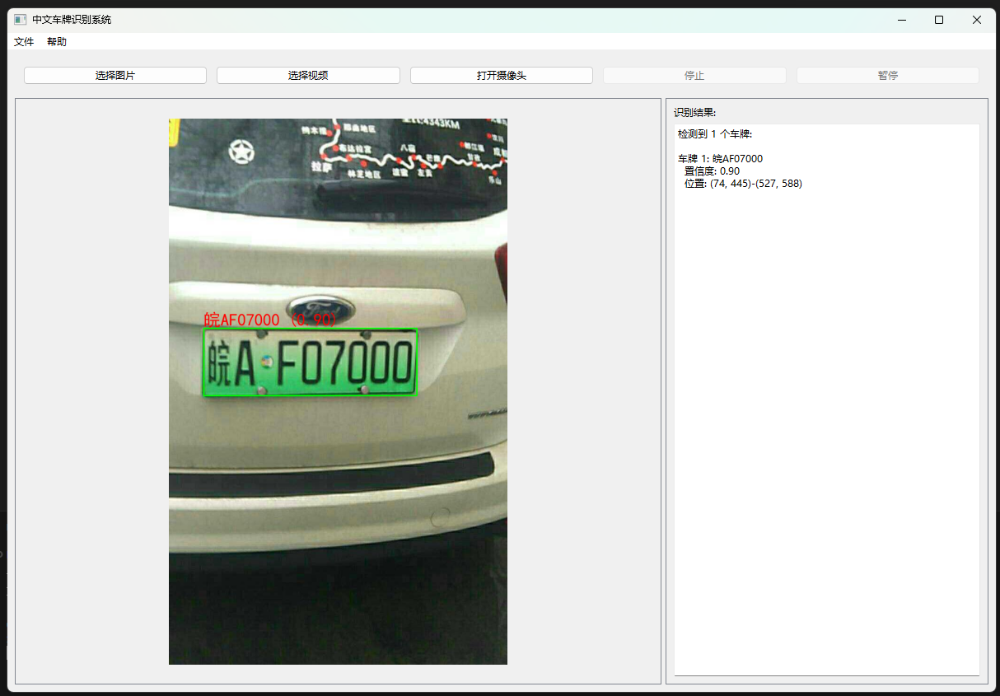
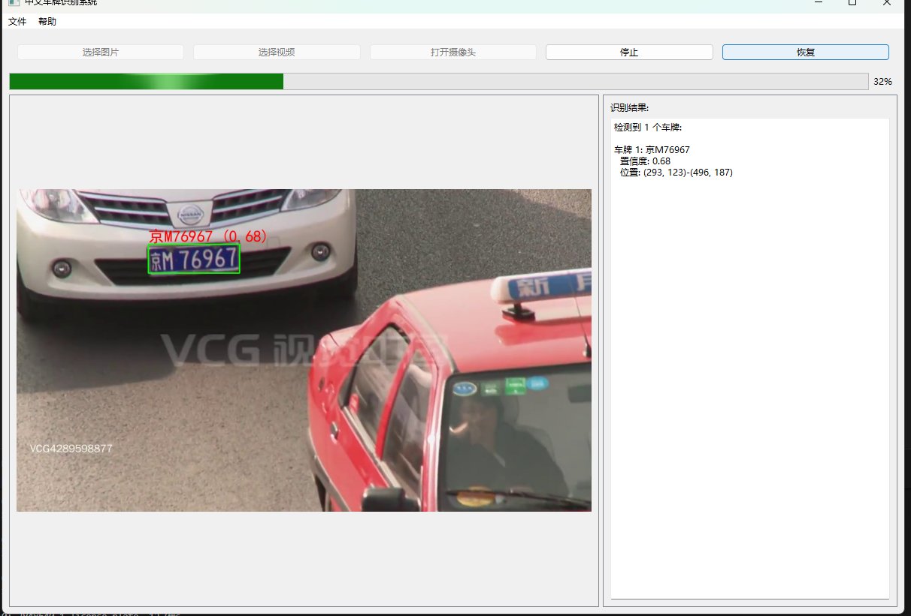
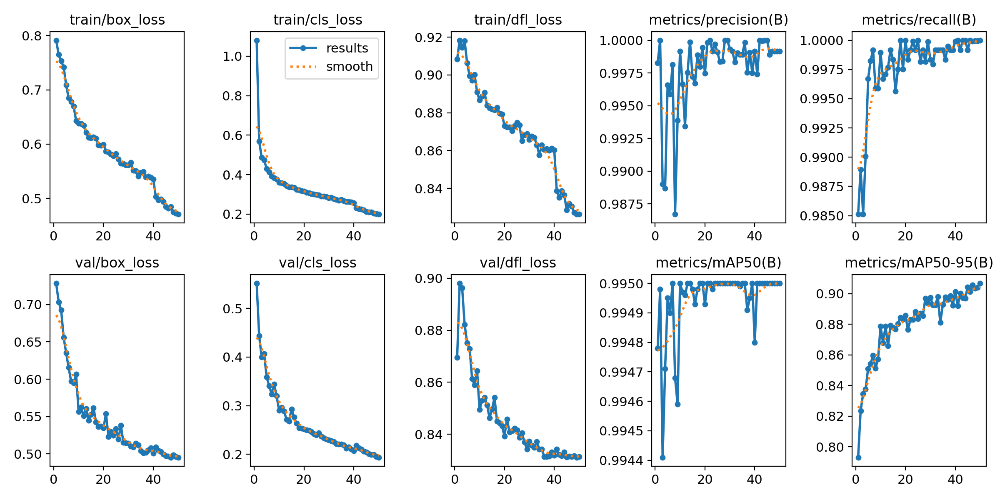
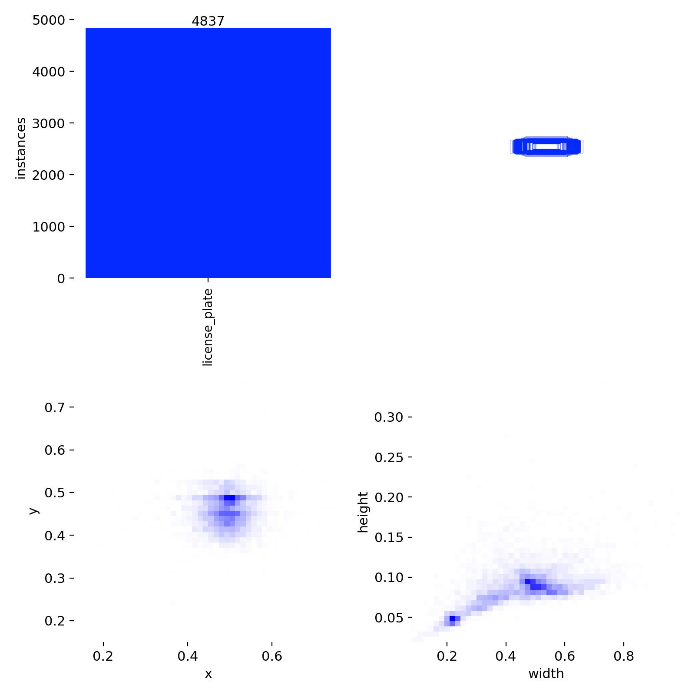

# 中文车牌识别系统（YOLO+LPRNet）

一个基于深度学习的中文车牌识别系统，集成了YOLO目标检测和LPRNet字符识别技术，能够从图像、视频或实时摄像头流中自动检测并识别车牌信息。

图片检测效果：

视频检测效果：

## 训练截图






## 项目特点

- **精准检测**：采用YOLO系列模型（支持v8/v11）准确定位车牌位置
- **高效识别**：使用LPRNet端到端识别模型，直接识别车牌上的中文、字母和数字
- **友好界面**：基于PySide6构建的图形用户界面，操作简单直观
- **多源输入**：支持处理单张图片、视频文件和实时摄像头流
- **多种车牌支持**：可识别蓝牌、绿牌（新能源车牌）等中国常见车牌类型
- **跨平台兼容**：支持Windows、Linux和macOS操作系统

## 项目结构

```
YOLO_LPRNet_Pytorch/
├── .gitignore                    # Git忽略文件配置
├── README.md                     # 项目说明文档
├── main.py                       # 主程序入口（GUI界面）
├── demo_integrated_lpr.py        # 集成演示脚本
├── train_LPRNet.py               # LPRNet字符识别模型训练脚本
├── train_yolo.py                 # YOLO车牌检测模型训练脚本
├── test_LPRNet.py                # LPRNet模型测试脚本
├── test_yolo.py                  # YOLO模型测试脚本
├── prepare_ccpd_data.py          # CCPD数据集处理工具
├── install_dependencies.py       # 依赖安装脚本
├── requirements.txt              # 项目依赖列表
├── data/                         # 数据相关目录
│   ├── NotoSansCJK-Regular.ttc   # 中文字体文件
│   ├── load_data.py              # 数据加载模块
│   └── lprnet/                   # LPRNet相关数据
├── model/                        # 模型定义目录
│   └── LPRNet.py                 # LPRNet模型定义
├── images/                       # 示例图像和视频
│   ├── test.jpg                  # 测试图片
│   └── video.mp4                 # 测试视频
├── weights/                      # 模型权重存储目录
│   ├── Final_LPRNet_model.pth    # LPRNet预训练权重
│   └── best.pt                   # YOLO训练后最佳权重
├── yolo_train_results/           # YOLO训练结果
├── yolo_utils.py                 # YOLO工具函数
├── yolo_config.yaml              # YOLO配置文件
├── yolo11n.pt                    # YOLOv11预训练模型
└── yolov8n.pt                    # YOLOv8预训练模型
```

## 快速开始

### 1. 环境配置

确保您已安装Python 3.8或更高版本，然后使用以下命令安装所有必要的依赖：

```bash
python install_dependencies.py
```

主要依赖包括：

- torch >= 1.7.1 (PyTorch深度学习框架)
- torchvision >= 0.8.2 (PyTorch视觉库)
- opencv-python >= 4.5.0 (图像处理)
- numpy >= 1.19.0 (数值计算)
- pillow >= 8.0.0 (图像处理，支持中文)
- ultralytics >= 8.0.0 (YOLO模型实现)
- PySide6 >= 6.4.0 (GUI界面库)
- 其他辅助库：matplotlib、pandas、tqdm等

### 2. 运行程序

安装完成后，可以直接运行以下命令启动带图形界面的应用程序：

```bash
python main.py
```

### 3. 功能使用

程序启动后，您可以：

- 点击"选择图片"按钮，选择单张图片进行车牌识别
- 点击"选择视频"按钮，选择视频文件进行车牌识别
- 点击"打开摄像头"按钮，使用摄像头进行实时车牌识别
- 使用"暂停/恢复"和"停止"按钮控制处理过程

## 模型训练（可选）

如果您需要训练自己的模型或微调现有模型（本项目模型用的ccpd2020的数据训练的YOLO和LPRnet），可以按照以下步骤进行：


### 1. 训练YOLO车牌检测模型

#### 1. 准备数据集

本项目推荐使用CCPD（中国城市停车数据集）进行训练。首先需要下载CCPD数据集 https://github.com/detectRecog/CCPD  ，然后使用提供的工具脚本将其转换为YOLO训练所需的格式：

```bash
python prepare_ccpd_data.py --ccpd_root ./data/CCPD/CCPD2020/ccpd_green --output_dir ./data/yolo --train_ratio 0.8
```

参数说明：

- `--ccpd_root`: CCPD数据集的根目录
- `--output_dir`: 处理后数据的输出目录
- `--train_ratio`: 训练集比例（剩余部分为验证集）

#### 2. 执行YOLO训练脚本

```bash
python train_yolo.py --model yolov8n.pt --config ./yolo_config.yaml --epochs 50 --batch_size 16 --img_size 640
```

参数说明：

- `--model`: 预训练模型路径或名称（支持yolov8n、yolov8s、yolo11n等）
- `--config`: YOLO配置文件路径
- `--epochs`: 训练轮数
- `--batch_size`: 批次大小
- `--img_size`: 输入图像大小
- `--lr0`: 初始学习率（可选）
- `--project`: 训练结果保存路径（默认`./runs/train/yolo_lpr`）
- `--device`: 训练设备（可选，留空自动选择GPU或CPU）

训练完成后，模型权重将保存在`./runs/train/yolo_lpr/weights/`目录下。

### 2. 训练LPRNet字符识别模型

#### 1. 准备数据集

```bash
python extract_ccpd_plates.py --ccpd_root ./data/CCPD/CCPD2020/ccpd_green/train --output_dir ./data/lprnet  --model_path ./weights/best.pt 
```

参数说明：

- `--ccpd_root`: CCPD数据集的根目录
- `--output_dir`: 处理后数据的输出目录
- `--model_path`: 使用的YOLO模型权重路径

#### 2. 执行LPRNet训练脚本

```bash
python train_LPRNet.py
```

参数说明：

- `--train_img_dirs`: 训练图像目录
- `--test_img_dirs`: 测试图像目录
- `--max_epoch`: 训练轮数
- `--pretrained_model`: 预训练模型路径

## 测试与评估

### 1. YOLO车牌检测测试

```bash
python test_yolo.py --model ./weights/best.pt --input ./images/test.jpg --save
```

参数说明：

- `--model`: 训练好的YOLO模型路径
- `--input`: 输入图像或视频路径
- `--conf`: 置信度阈值（默认0.5）
- `--iou`: IoU阈值（默认0.45）
- `--save`: 是否保存结果图像
- `--no-display`: 是否不显示结果图像（默认False）

### 2. LPRNet字符识别测试

```bash
python test_LPRNet.py
```

### 3. 集成系统测试

```bash
python demo_integrated_lpr.py --yolo_model ./weights/best.pt --lpr_model ./weights/Final_LPRNet_model.pth --image ./images/test.jpg --save
```

参数说明：

- `--yolo_model`: YOLO模型权重路径
- `--lpr_model`: LPRNet模型权重路径
- `--image`: 测试图像路径
- `--save`: 是否保存结果图像
- `--conf_threshold`: YOLO检测置信度阈值
- `--iou_threshold`: YOLO检测IoU阈值

## 技术原理

### 1. YOLO车牌检测

YOLO（You Only Look Once）是一种单阶段目标检测算法，能够在一次前向传播中同时预测目标的位置和类别。本项目使用YOLOv8或YOLOv11模型进行车牌检测，具有以下优势：

- 检测速度快，适合实时应用
- 准确率高，能够处理不同光照、角度和背景的复杂场景
- 支持多类别检测，可以同时识别不同类型的车牌

### 2. LPRNet字符识别

LPRNet是一种专为车牌识别设计的端到端深度学习模型，它直接从车牌图像中识别出完整的车牌号码，避免了传统方法中复杂的字符分割步骤。LPRNet的主要特点包括：

- 采用CNN架构提取特征
- 使用CTC（Connectionist Temporal Classification）损失函数处理变长序列
- 能够有效识别中文、字母和数字的组合
- 模型轻量，推理速度快

### 3. 系统集成流程

整个车牌识别系统的工作流程如下：

1. 使用YOLO模型检测输入图像中的车牌位置
2. 根据检测结果裁剪出车牌区域
3. 将裁剪后的车牌图像送入LPRNet模型进行字符识别
4. 将检测和识别结果在界面上显示或保存

## 常见问题与解决方案

1. **中文显示问题**：如果出现中文乱码，确保系统中安装了中文字体，如SimHei（黑体）

2. **模型加载失败**：检查模型文件路径是否正确，确保模型文件没有损坏

3. **检测精度问题**：可以通过调整置信度阈值和IoU阈值来平衡精度和召回率

4. **性能优化**：对于实时应用，可以使用更小的模型（如yolov8n或yolo11n）和降低输入图像分辨率

5. **摄像头无法打开**：检查摄像头驱动是否正常，或尝试修改摄像头索引

## 致谢

本项目参考了多个开源项目和研究成果，特别感谢：

- Ultralytics团队提供的YOLO实现
- 所有为CCPD数据集做出贡献的研究人员
- LPRNet的原始作者和贡献者

## 联系方式

如有任何问题或建议，请通过GitHub Issues或Pull Requests与我联系。
或者发送邮件： 1774532899@qq.com


